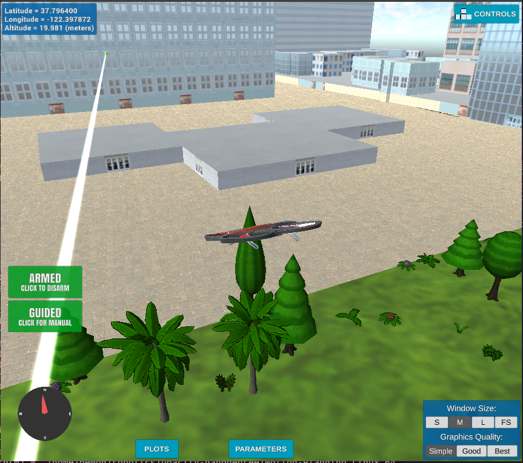

# FCND - 3D Motion Planning



## To complete this project on your local machine, follow these instructions:
### Step 1: Download the Simulator
This is a new simulator environment!  

Download the Motion-Planning simulator for this project that's appropriate for your operating system from the [simulator releases respository](https://github.com/udacity/FCND-Simulator-Releases/releases).

### Step 2: Set up your Python Environment
If you haven't already, set up your Python environment and get all the relevant packages installed using Anaconda following instructions in [this repository](https://github.com/udacity/FCND-Term1-Starter-Kit)

### Step 3: Clone this Repository
```sh
git clone https://github.com/udacity/FCND-Motion-Planning
```
### Step 4: Test setup
The first task in this project is to test the [solution code](https://github.com/udacity/FCND-Motion-Planning/blob/master/backyard_flyer_solution.py) for the Backyard Flyer project in this new simulator. Verify that your Backyard Flyer solution code works as expected and your drone can perform the square flight path in the new simulator. To do this, start the simulator and run the [`backyard_flyer_solution.py`](https://github.com/udacity/FCND-Motion-Planning/blob/master/backyard_flyer_solution.py) script.

```sh
source activate fcnd # if you haven't already sourced your Python environment, do so now.
python backyard_flyer_solution.py
```
The quad should take off, fly a square pattern and land, just as in the previous project. If everything functions as expected then you are ready to start work on this project. 

### Step 5: Inspect the relevant files
For this project, you are provided with two scripts, `motion_planning.py` and `planning_utils.py`. Here you'll also find a file called `colliders.csv`, which contains the 2.5D map of the simulator environment. 

### Step 6: Explain what's going on in  `motion_planning.py` and `planning_utils.py`

`motion_planning.py` is basically a modified version of `backyard_flyer.py` that leverages some extra functions in `planning_utils.py`. It should work right out of the box.  Try running `motion_planning.py` to see what it does. To do this, first start up the simulator, then at the command line:
 
```sh
source activate fcnd # if you haven't already sourced your Python environment, do so now.
python motion_planning.py
```

You should see the quad fly a jerky path of waypoints to the northeast for about 10 m then land.  What's going on here? Your first task in this project is to explain what's different about `motion_planning.py` from the `backyard_flyer_solution.py` script, and how the functions provided in `planning_utils.py` work. 

### Step 7:planner steps

Your planning algorithm is going to look something like the following:

Grid based representation of the world given as a .csv file.
intiate the starting and goal locations inside the grid.
A* algorithm to operate on the searching from start to goal.
use path cleaning method to reduce the unwanted stopppings along the path.


### Try flying more complex trajectories
In this project, things are set up nicely to fly right-angled trajectories, where you ascend to a particular altitude, fly a path at that fixed altitude, then land vertically. However, you have the capability to send 3D waypoints and in principle you could fly any trajectory you like. Rather than simply setting a target altitude, try sending altitude with each waypoint and set your goal location on top of a building!

### Adjust your deadbands
Adjust the size of the deadbands around your waypoints, and even try making deadbands a function of velocity. To do this, you can simply modify the logic in the `local_position_callback()` function.

### Add heading commands to your waypoints
This is a recent update! Make sure you have the [latest version of the simulator](https://github.com/udacity/FCND-Simulator-Releases/releases). In the default setup, you're sending waypoints made up of NED position and heading with heading set to 0 in the default setup. Try passing a unique heading with each waypoint. If, for example, you want to send a heading to point to the next waypoint, it might look like this:

```python
# Define two waypoints with heading = 0 for both
wp1 = [n1, e1, a1, 0]
wp2 = [n2, e2, a2, 0]
# Set heading of wp2 based on relative position to wp1
wp2[3] = np.arctan2((wp2[1]-wp1[1]), (wp2[0]-wp1[0]))
```

This may not be completely intuitive, but this will yield a yaw angle that is positive counterclockwise about a z-axis (down) axis that points downward.

Put all of these together and make up your own crazy paths to fly! Can you fly a double helix?? 


Ok flying a double helix might seem like a silly idea, but imagine you are an autonomous first responder vehicle. You need to first fly to a particular building or location, then fly a reconnaissance pattern to survey the scene! Give it a try!